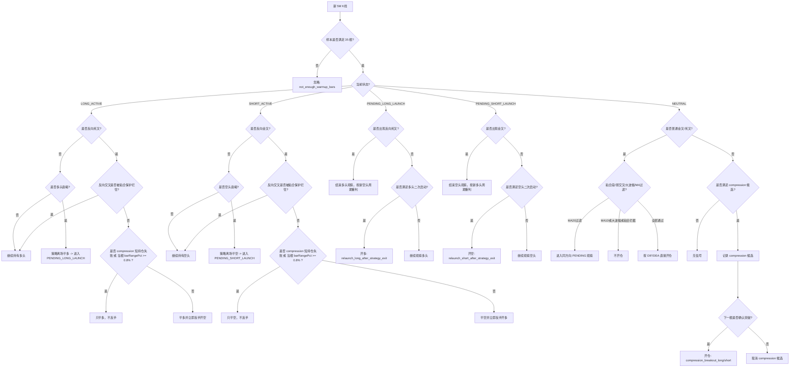

# difDeaLifecycle 当前限制版策略逻辑

## 1. 策略定位

`difDeaLifecycle` 目前是一版带较多限制条件的 5 分钟趋势跟踪策略。

核心思想不是“只要 DIF/DEA 交叉就开仓”，而是分成 4 条链路：

1. 普通交叉开仓
2. 压缩突破开仓
3. 策略离场后的原方向二次启动
4. 持仓中的离场与反手控制

当前这版的重点是：

- 尽量过滤掉弱交叉、粘合段、逆大级别均线方向、单根大波幅追单
- 允许在趋势离场后观察原方向是否再次启动
- 允许空仓压缩突破启动
- 但对短持仓失败单、反手当根大波幅，增加“只平不反手”保护

## 2. 主要参数与限制

当前代码里的主要硬限制如下：

- 只处理 `5M`
- 预热K线数：`35`
- 弱交叉过滤：`abs(macd) < 0.20`
- 普通开仓/反手大波幅过滤：`barRangePct >= 0.8%`
- MA10 反向过滤：连续 2 次反向斜率时，普通交叉直接不开仓
- MA20 反向过滤：只对普通交叉生效，进入同方向观察态，不直接开仓
- compression 短持仓失败只平不反手：
  - 来源是 `compression_breakout_long/short`
  - 持仓 `holdBars <= 3`
  - 反向交叉时先平仓，不立刻反手

其中：

- `barRangePct = (high - low) / open * 100`
- “粘合段”使用 `dif/dea` 差值窗口统计
- “反向交叉粘合保护”仍然保留，避免极小张口的假反手

## 3. 开仓逻辑

### 3.1 普通 DIF/DEA 交叉开仓

空仓时：

- 金叉：`prevDif < prevDea && currentDif >= currentDea`
- 死叉：`prevDif > prevDea && currentDif <= currentDea`

开仓前依次做限制：

1. 粘合段过滤
2. 弱交叉过滤
3. 单根大波幅过滤，`barRangePct >= 0.8%` 直接拦
4. MA20 反向结构过滤：
   - 不直接开仓
   - 进入同方向 `PENDING_LONG_LAUNCH / PENDING_SHORT_LAUNCH`
5. MA10 反向结构过滤：
   - 直接不开仓
6. 全部通过后，才执行普通交叉开仓

### 3.2 空仓压缩突破开仓

当空仓且普通交叉没有直接开仓时，还会检查压缩突破：

- 最近 8 根里：
  - 至少 6 根 `abs(macd) <= 0.35`
  - 至少 6 根 `abs(dif - dea) <= 0.20`
- 然后记录实体上沿/下沿
- 突破当根只记录候选
- 下一根确认后，才执行：
  - `compression_breakout_long`
  - `compression_breakout_short`

### 3.3 观察态二次启动

观察态来源目前主要有：

1. 策略离场后的原方向观察
2. 弱交叉过滤后的观察
3. MA20 反向结构过滤后的观察

观察态下，如果出现新的反向交叉，就结束当前观察，按新周期重新判断。

如果没有反向交叉，则继续检查原方向是否再次启动：

- 多头观察：
  - `macd` 连续 3 根在 0 轴上方
  - `close` 连续 3 根走强
  - 相对观察起点有最少间隔
  - 结构仍未被破坏
- 空头观察同理

满足后分别触发：

- `relaunch_long_after_strategy_exit`
- `relaunch_short_after_strategy_exit`

## 4. 持仓离场与反手逻辑

### 4.1 持仓离场

多头持仓时：

- 反向死叉：优先离场
- 或 `macd` 缩小 + `close` 走弱：策略离场

空头持仓时：

- 反向金叉：优先离场
- 或 `macd` 恢复 + `close` 走强：策略离场

### 4.2 反手控制

默认情况下：

- 多头遇反向死叉，允许 `LEAVE_LONG + reverseEntry=true`
- 空头遇反向金叉，允许 `LEAVE_SHORT + reverseEntry=true`

但现在新增了两层“只平不反手”限制：

1. **compression 短持仓失败只平不反手**
   - 当前持仓来源是 `compression_breakout_long/short`
   - 且 `holdBars <= 3`
   - 遇到反向交叉时：
     - 只平旧仓
     - `reverseEntryAllowed=false`

2. **反手当根大波幅只平不反手**
   - 反向交叉当根
   - `barRangePct >= 0.8%`
   - 执行：
     - 只平旧仓
     - `reverseEntryAllowed=false`

这样做的目的是避免：

- compression 突破失败后马上反向再亏一笔
- 剧烈单根波动里直接反手追进去

## 5. 策略流程图

## 6. 当前这版的策略性格

当前这版更接近“中频偏谨慎”的 5 分钟趋势策略：

- 普通交叉不再裸奔
- 大波幅追单会被明显抑制
- 压缩突破仍保留
- 策略离场后允许原方向二次启动
- 但失败 compression 单和剧烈反手单会被额外保护

如果后面继续调，最值得继续观察的两块是：

1. `compression_breakout_*` 的确认质量是否还要再收
2. `PENDING_*` 观察态是否还需要更强的结构确认
